前几篇我们讲了这么如何安装pve以及软路由等虚拟机，今天我们来讲一下如何使用模板来创建一个linux虚拟机。

## 1.下载linux模板

我们找到local存储或者我们上次添加的OS目录
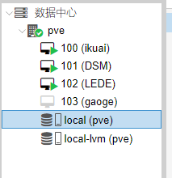

点开后他应该会包含有容器模板选项，如下图
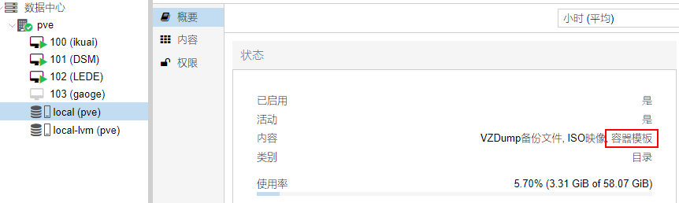
我们选择内容
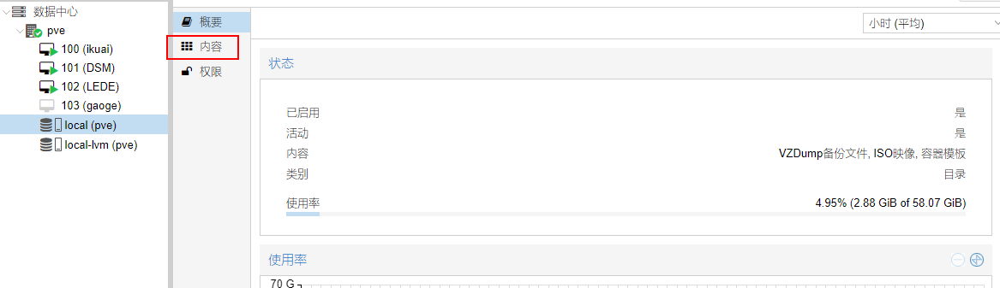
点击模板
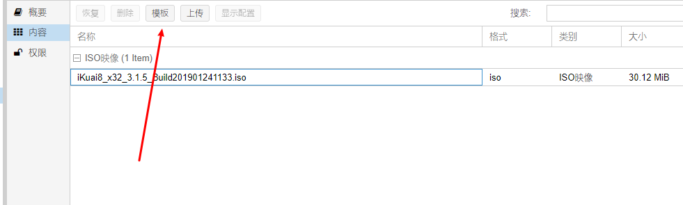
这里我们选择ubuntu-18.10
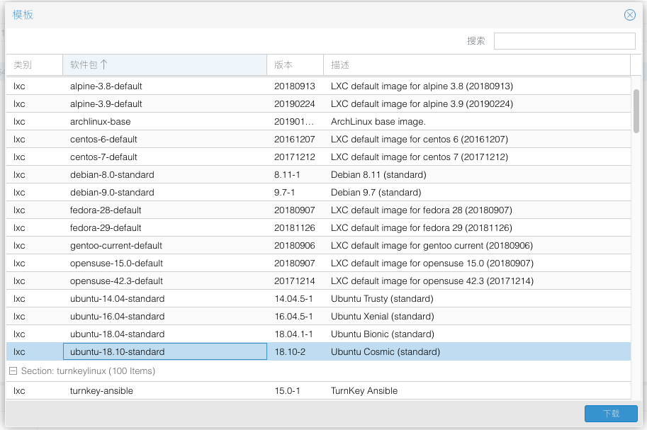
点击下载
由于下载服务器在国外，出国可以获得更好的下载速度（人不出国网出国）
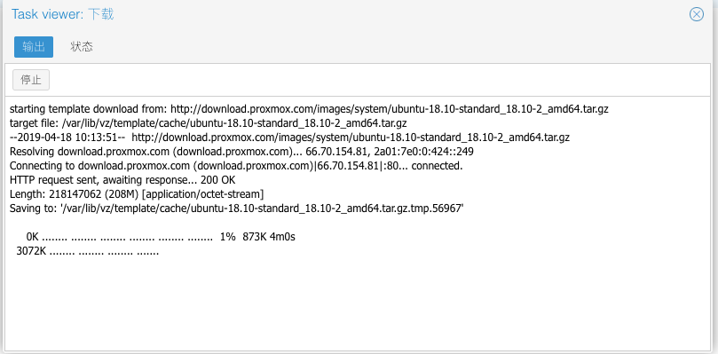
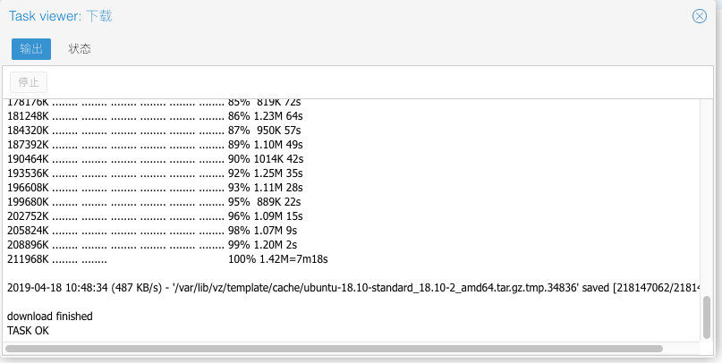
这时候可以建linux虚拟机了

## 2.创建虚拟机

点击创建CT
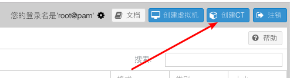
设置主机名和root密码,注意去掉无特权容器的勾（如果要使用nfs的话）然后下一步
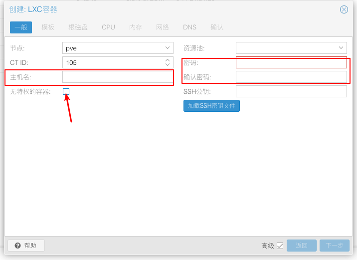
选择模板，下一步
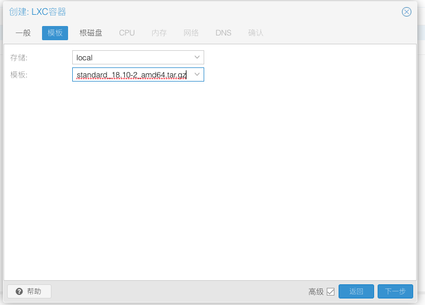
设置磁盘大小，下一步
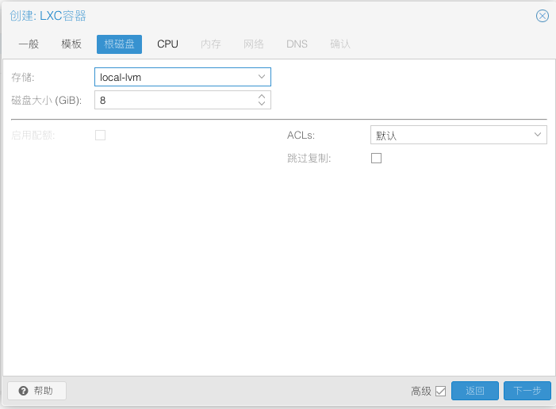
设置cpu数量（其实就是使用的cpu资源比例）
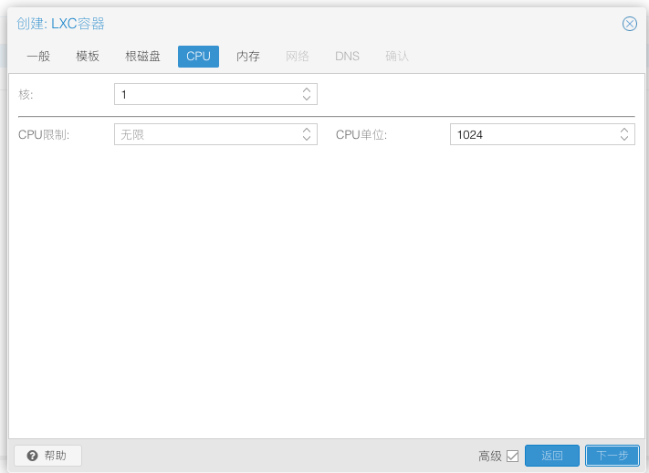
设置内存大小，我设置到2g
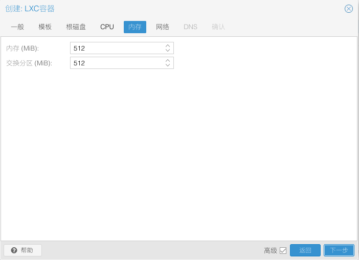
设置网络，注意桥接的接口，注意ip，默认静态，需要手动设置，或者使用dhcp获取
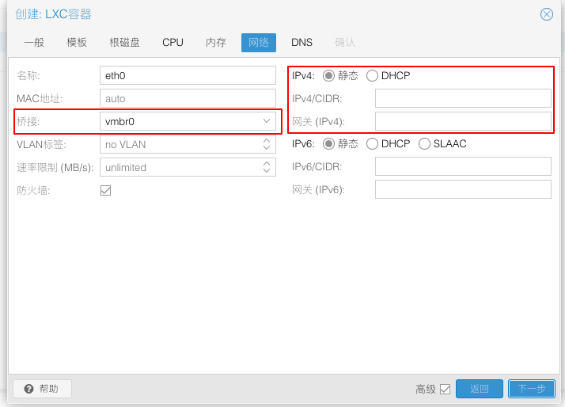
设置dns，建议在主机设置dns后使用默认设置
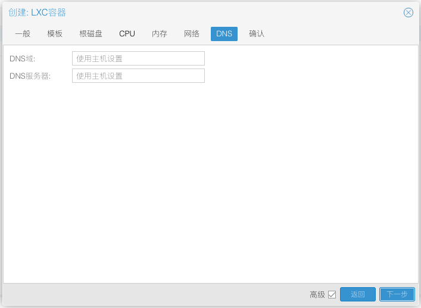
确认配置，完成
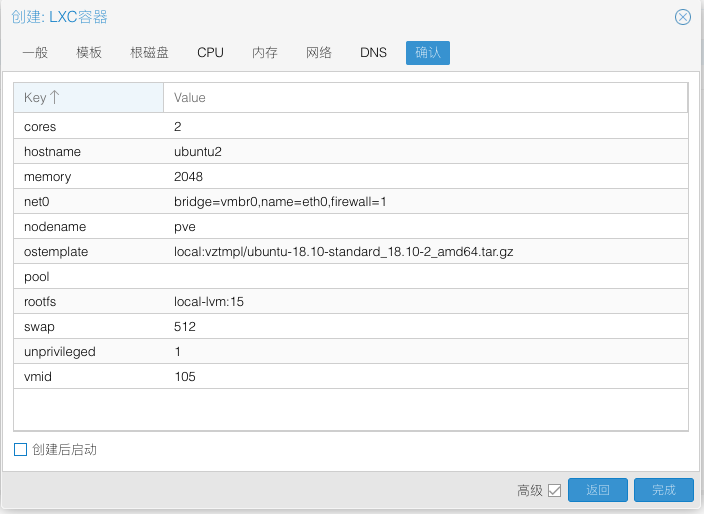
显示ok表示创建成功
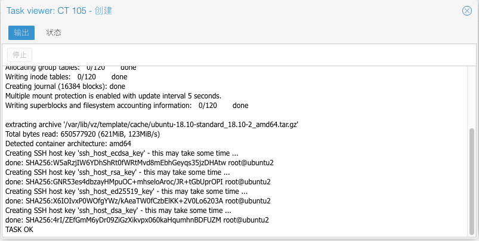
如果要使用nfs挂载到这里打开，否则死活挂载不了
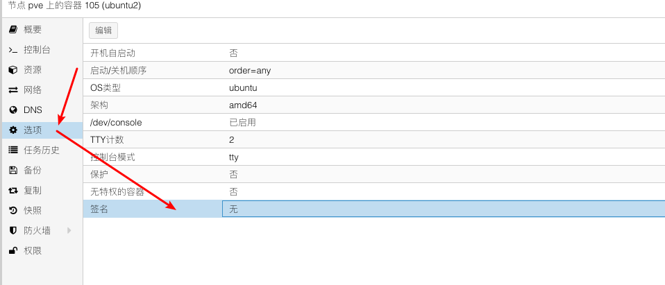
然后就可以启动了
由于使用的是半虚拟化，加载的是proxmox宿主机的内核，启动速度超快，占用资源也非常小，
下篇我们讲一下如何使用ubuntu虚拟机编译原版openwrt固件