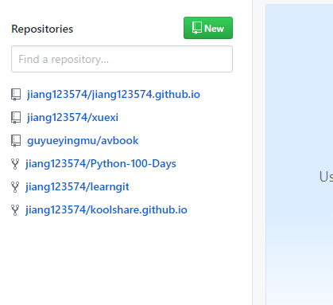
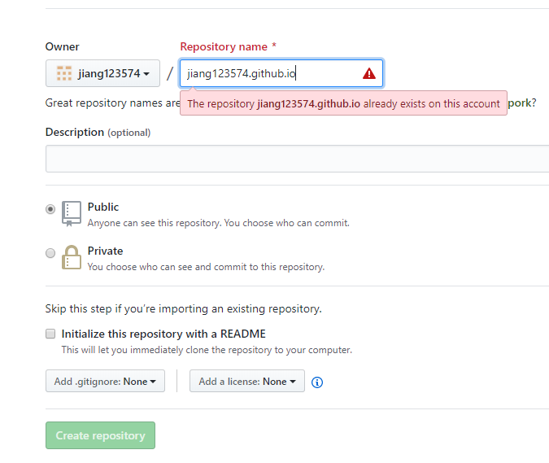
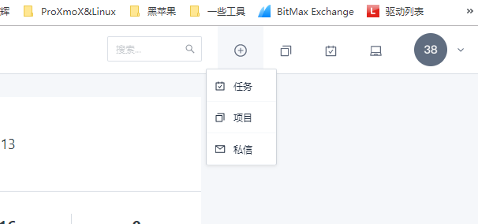
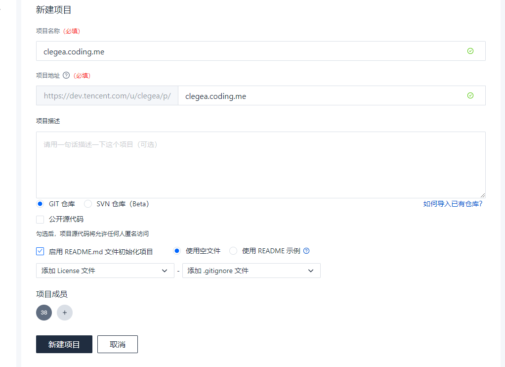
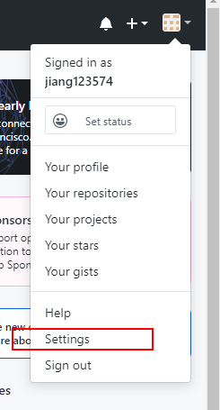
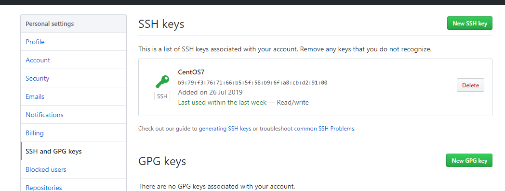
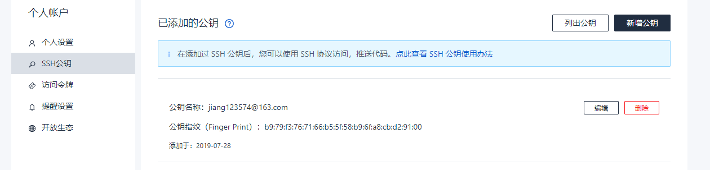
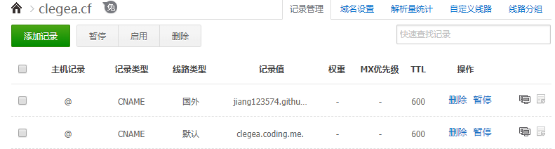

---

title: 利用hexo+github+coding（腾讯云开发平台）架设个人博客
date: 2019-07-28 23:00:40
tags: hexo
---

## 一、Hexo介绍

初次了解到hexo是在**骆昊**大神的python教程《[Python - 100天从新手到大师](https://github.com/jackfrued/Python-100-Days)》,然后就去百度以及官网上看了下资料，发现这是一个非常轻量、简洁、部署方式非常“程序员”的一个个人博客。
* Hexo 的中文官网：http://hexo.io/zh-cn/
* 作者 Tommy Chen：https://zespia.tw/

## 二、部署

部署分以下几步走
1. 搭建node环境
2. 搭建git环境
3. 安装hexo以及GitHub、coding设置
4. 个人域名设置

>由于我是部署在CentOS 7 上的，所以一下内容均以CentOS 7 作为平台

### 2.1 搭建node环境
CentOS下非常简单
只要输入以下命令就可以自动安装node以及npm（npm是node的包管理工具）
```sh
yum install nodejs
yum install npm
```

可以使用以下命令查看是否安装成功

```sh
node -v
npm -v
```
npm加速
```sh
npm config set registry https://registry.npm.taobao.org
```

### 2.2 搭建git环境


和node一样简单

```sh
yum install git
```

使用以下命令查看版本

```sh
git --version
```

### 2.3 安装hexo以及GitHub、coding设置

#### 2.3.1 安装hexo

首先CD到home目录下,

```sh
cd /home
```

使用以下命令安装hexo（安装过程中会自动创建一个blog文件夹路径为/home/blog）

```sh
npm install hexo-cli -g 
hexo init blog
cd blog
npm install
```

- node_modules: 依赖包
- public：存放生成的页面
- scaffolds：生成文章的一些模板
- source：用来存放你的文章
- themes：主题
- _config.yml: 博客的配置文件 

```sh
hexo g #生成静态页面
hexo server #启动本地服务
```

#### 2.3.2 创建github仓库
首先注册一个GitHub账户
注册完成登录后，在github.com中看到一个**new**，新建仓库



创建一个和你用户名相同的仓库，后面加.github.io,<**yourname.github.io**>这样在部署到GitHub page的时候等于网页在你的根目录,这里因为我已经创建过了，所以是红色叹号



点击**Create repository**。


#### 2.3.3 创建coding仓库

创建coding仓库的时候有个小坑，就是coding个人仓库业务好像被腾讯收购了，现在进入coding个人仓库要从

**腾讯云开发者平台**：https://dev.tencent.com/ 进入

绑定邮箱时尽量使用和github相同的邮箱账户

从右上角的＋号-项目 新建仓库



项目名称使用<**yourname.coding.me**>创建，同样是为了pages服务方便



点击新建项目

#### 2.3.4 生成ssh key 添加到github和coding

回到ContOS 7 中

```sh
git config --global user.name "yourname"
git config --global user.email "youremail"
```

这里的yourname输入你的GitHub用户名，youremail输入你GitHub的邮箱。

可以用以下两条命令检查git的用户名和密码

```sh
git config user.name
git config user.email
```

使用以下命令生成ssh key 

```sh
ssh-keygen -t rsa -C "youremail"
```

id_rsa是你这台电脑的私人秘钥，不能给别人看的，id_rsa.pub是公共秘钥，可以随便给别人看。把这个公钥放在GitHub上，这样当你链接GitHub自己的账户时，它就会根据公钥匹配你的私钥，当能够相互匹配时，才能够顺利的通过git上传你的文件到GitHub上。



而后在GitHub的setting中，找到SSH keys的设置选项，点击New SSH key
把你的id_rsa.pub里面的信息复制进去。

coding操作类似


绑定完成后可以使用以下命令来分别测试是否可以正确连接
```sh
ssh -T git@github.com
ssh -T git@git.dev.tencent.com
```
安装git插件
```sh
npm install hexo-deployer-git --save
```
如果测试无误，就可以使用以下命令来部署到github和coding上了
```sh
hexo clean #做以下清理
hexo g #生成页面
hexo d #部署到git仓库
#hexo d --g #简化命令
```

以上命令需要在blog目录下进行

#### 2.3.5 个人域名设置

我这里使用dnspod域名解析做例子，dnspod搭配freenom免费域名非常好用

添加两个CNAME记录，记录值分别填两个git仓库的静态域名



同时，在hexo的./blog/source目录下创建一个CNAME文件，内容为你的域名，比如我的就是

```
clegea.cf
```

填写完成后保存，重新部署一下，过一会应该就能使用你自己的个人域名访问了

## 三、更换主题及一些优化设置

博客已经搭建完成，不过不是很好看，这时候我们就可以安装来进行一些美化。

官方主题库：https://hexo.io/themes/

这里我推荐NexT主题，非常简洁，符合当下审美

NexT官方文档：http://theme-next.iissnan.com/

我们直接git NexT的最新版本，使用以下命令

```sh
cd /home/blog #确保在blog目录下
git clone https://github.com/theme-next/hexo-theme-next themes/next
```

修改blog目录下的 _config.yml文件启用next

简书上有一篇非常详细的next主题的配置文件说明:[Hexo的Next主题详细配置](https://www.jianshu.com/p/3a05351a37dc)
**使首页使用缩略模式**
进入hexo博客项目的themes/next目录
用文本编辑器打开_config.yml文件
搜索"auto_excerpt",找到如下部分：
```yml
#Automatically Excerpt. Not recommand.
#Please use <!-- more --> in the post to control excerpt accurately.

auto_excerpt:

  enable: false

  length: 150
```
把enable改为对应的false改为true，然后hexo d -g
**使用本地图片**
1. 确认全局配置文件_config.yml 中有 post_asset_folder:true。
2. 在hexo的目录下执行
```sh
npm install https://github.com/7ym0n/hexo-asset-image --save
```

**打开搜索功能**
1. 安装搜索：在Hexo的根目录下，打开命令可执行窗口，执行如下命令：
```sh
npm install hexo-generator-searchdb --save
```
2. 全局配置文件_config.yml，新增如下内容：
```yml
search:
  path: search.xml
  field: post
  format: html
  limit: 10000
```
3. hexo主题配置文件（\themes\next\_config.yml），修改local_search的enable为true：
``` yml
local_search:
  enable: true
  # if auto, trigger search by changing input
  # if manual, trigger search by pressing enter key or search button
  trigger: auto
  # show top n results per article, show all results by setting to -1
  top_n_per_article: 1
```