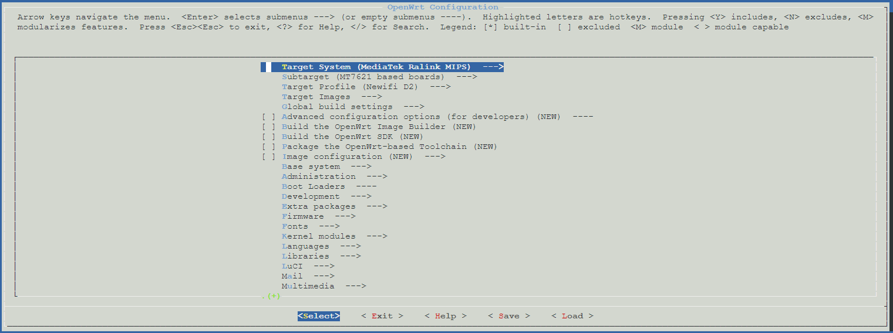

上篇讲了如何使用模板创建一个低资源占用高效的linux虚拟机
这篇我们讲一下如何利用这个虚拟机进行官方原版openwrt的编译，结合前段时间到手的新路由3，做一个简单的，支持802.11r的ap
## 创建非root用户
由于openwrt不能使用root用户git和编译，首要任务是创建一个非root用户，用来进行git和编译
首先，我们进入控制台打开root远程登录（确保更好的使用体验）

```sh
sudo nano /etc/ssh/sshd_config  
找到下面相关配置：
# Authentication:  
#LoginGraceTime 120  
#PermitRootLogin prohibit-password  
#StrictModes yes  
更改为：
# Authentication:  
#LoginGraceTime 120 
PermitRootLogin yes  
#StrictModes yes  
```
保存退出
重启ubuntu
```sh
reboot
```
然后就可以使用shell工具远程登录ubuntu虚拟机了
怎么登录我就不细说了，win下用putty或者xshel，我是mac，直接用终端登录
查看一下时间
```sh
date
```
发现时间不对，是由于时区的缘故，我们使用以下命令把时区设置到上海
```sh
timedatectl set-timezone Asia/Shanghai
```
重新查看一下时间，已经正确
把源地址更换到国内
```sh
nano /etc/apt/sources.list
#把
deb http://archive.ubuntu.com/ubuntu cosmic main restricted universe multiverse
deb http://archive.ubuntu.com/ubuntu cosmic-updates main restricted universe multiverse
deb http://archive.ubuntu.com/ubuntu cosmic-security main restricted universe multiverse
#更换为
deb http://mirrors.aliyun.com/ubuntu cosmic main restricted universe multiverse
deb http://mirrors.aliyun.com/ubuntu cosmic-updates main restricted universe multiverse
deb http://mirrors.aliyun.com/ubuntu cosmic-security main restricted universe multiverse
```

更新一下系统
```sh
sudo apt-get update && sudo apt-get upgrade -y
```
创建用户
```sh
adduser x #创建一个叫做x的用户,会要求你输入密码，然后填一些资料，资料可以直接会车跳过
```
赋予新用户root权限

```sh
nano /etc/sudoers #打开文件

#在  root    ALL=(ALL:ALL) ALL 下面添加
x    ALL=(ALL:ALL) ALL
```
保存退出，然后重启ubuntu,使用新用户登录

## 编译openwrt

上回我们说编译原版openwrt，考虑了一下，还是教大家用lean的源码进行编译，因为功能更多更全，官方原版的只要换git地址就能一样编译。
首先我们使用shell工具登录ubuntu,推荐使用xsell和putty。
首先我们确保自己使用新建的用户登录，然后回到home目录下
```sh
sudo apt-get -y install build-essential asciidoc binutils bzip2 gawk gettext git libncurses5-dev libz-dev patch unzip zlib1g-dev lib32gcc1 libc6-dev-i386 subversion flex uglifyjs git-core gcc-multilib p7zip p7zip-full msmtp libssl-dev texinfo libglib2.0-dev xmlto qemu-utils upx libelf-dev autoconf automake libtool autopoint
#安装依赖
cd #回到home目录
```
[Lean源码地址](https://github.com/coolsnowwolf/lede)
下载git包（可能速度会比较慢，建议出国）
```sh
git clone https://github.com/coolsnowwolf/lede.git #如果要编译官方openwrt 地址换成 https://www.github.com/openwrt/openwrt

```
下载完成后会在

```sh
/home/x/lede
```

目录下

```sh
cd /home/x/lede
```
源码插件(脚本等)更新并安装
```sh
./scripts/feeds update -a 
./scripts/feeds install -a
```
输入`make menuconfig`进行配置编辑
我是新路由3
配置按下图设置，其他软件包在Luci→Applications中设置

插件的一些说明
>LuCI	Applications	luci-app-accesscontrol	访问时间控制
LuCI	Applications	luci-app-adblock	ADB广告过滤
LuCI	Applications	luci-app-adbyby-plus	广告屏蔽大师Plus +
LuCI	Applications	luci-app-advanced-reboot	高级重启
LuCI	Applications	luci-app-ahcp	支持AHCPd
LuCI	Applications	luci-app-aliddns	阿里DDNS客户端
LuCI	Applications	luci-app-amule	aMule是一个跨平台的ED2K/KAD客户端  P2P电驴下载
LuCI	Applications	luci-app-aria2	Aria2下载
LuCI	Applications	luci-app-arpbind	IP/MAC绑定
LuCI	Applications	luci-app-asterisk	支持Asterisk电话服务器
LuCI	Applications	luci-app-attendedsysupgrade	固件更新升级相关
LuCI	Applications	luci-app-autoreboot	支持计划重启
LuCI	Applications	luci-app-bcp38	BCP38网络入口过滤(不确定)
LuCI	Applications	luci-app-bird4	Bird4服务(未知)
LuCI	Applications	luci-app-bird6	Bird6服务(未知)
LuCI	Applications	luci-app-bmx6	BMX6路由协议
LuCI	Applications	luci-app-bmx7	BMX7路由协议
LuCI	Applications	luci-app-cjdns	加密IPV6网络相关
LuCI	Applications	luci-app-caldav	联系人
LuCI	Applications	luci-app-clamav	ClamAV杀毒软件
LuCI	Applications	luci-app-commands	Shell命令模块
LuCI	Applications	luci-app-cshark	CloudShark捕获工具
LuCI	Applications	luci-app-ddns	动态域名 DNS 
LuCI	Applications	luci-app-diag-core	core诊断工具
LuCI	Applications	luci-app-dnscrypt-proxy	DNSCrypt解决DNS污染
LuCI	Applications	luci-app-dnsforwarder	DNSForwarder防DNS污染
LuCI	Applications	luci-app-dnspod	DNSPod
LuCI	Applications	luci-app-dump1090	民航无线频率(不确定)
LuCI	Applications	luci-app-dynapoint	DynaPoint(未知)
LuCI	Applications	luci-app-e2guardian	Web内容过滤器
LuCI	Applications	luci-app-filetransfer	文件传输
LuCI	Applications	luci-app-firewall	添加防火墙
LuCI	Applications	luci-app-freifunk-diagnostics	freifunk组件 诊断(未知)
LuCI	Applications	luci-app-freifunk-policyrouting	freifunk组件 策略路由(未知)
LuCI	Applications	luci-app-freifunk-widgets	freifunk组件 Widgets(未知)
LuCI	Applications	luci-app-frpc	内网穿透 Frp
LuCI	Applications	luci-app-fwknopd	Firewall Knock Operator服务器
LuCI	Applications	luci-app-guest-wifi	WiFi访客网络
LuCI	Applications	luci-app-hd-idle	硬盘休眠
LuCI	Applications	luci-app-hnet	Homenet Status家庭网络控制协议
LuCI	Applications	luci-app-ipsec-vpnd	VPN服务器 IPSec
LuCI	Applications	luci-app-lxc	LXC容器管理
LuCI	Applications	luci-app-meshwizard	网络设置向导
LuCI	Applications	luci-app-minidlna	完全兼容DLNA / UPnP-AV客户端的服务器软件
LuCI	Applications	luci-app-mjpg-streamer	兼容Linux-UVC的摄像头程序
LuCI	Applications	luci-app-mwan3	MWAN负载均衡
LuCI	Applications	luci-app-mwan3helper	MWAN3分流助手
LuCI	Applications	luci-app-n2n_v2	N2N 内网穿透 N2N v2 VPN服务
LuCI	Applications	luci-app-nlbwmon	网络带宽监视器
LuCI	Applications	luci-app-noddos	NodDOS Clients 阻止DDoS攻击  
LuCI	Applications	luci-app-ntpc	NTP时间同步服务器
LuCI	Applications	luci-app-ocserv	OpenConnect VPN服务
LuCI	Applications	luci-app-olsr	OLSR配置和状态模块
LuCI	Applications	luci-app-olsr-services	OLSR服务器
LuCI	Applications	luci-app-olsr-viz	OLSR可视化
LuCI	Applications	luci-app-openvpn	OpenVPN客户端
LuCI	Applications	luci-app-openvpn-server	易于使用的 OpenVPN 服务器 Web-UI
LuCI	Applications	luci-app-p910nd	打印服务器模块
LuCI	Applications	luci-app-pagekitec	Pagekite 内网穿透客户端
LuCI	Applications	luci-app-polipo	Polipo 是一个小型且快速的网页缓存代理。
LuCI	Applications	luci-app-pppoe-relay	PPPoE NAT穿透 点对点协议（PPP）
LuCI	Applications	luci-app-pptp-server	VPN服务器 PPTP 
LuCI	Applications	luci-app-privoxy	Privoxy网络代理（带过滤无缓存）
LuCI	Applications	luci-app-qos	流量服务质量(QoS)流控
LuCI	Applications	luci-app-radicale	CalDAV/CardDAV同步工具
LuCI	Applications	luci-app-ramfree	释放内存
LuCI	Applications	luci-app-rp-pppoe-server	Roaring Penguin PPPoE Server 服务器
LuCI	Applications	luci-app-samba	网络共享(samba)
LuCI	Applications	luci-app-samba4	网络共享(samba4)
LuCI	Applications	luci-app-sfe	Turbo ACC网络加速(开启Fast Path转发加速)
LuCI	Applications	luci-app-shadowsocks-libev	SS-libev服务端
LuCI	Applications	luci-app-shairplay	支持AirPlay功能
LuCI	Applications	luci-app-siitwizard	SIIT配置向导  SIIT-Wizzard
LuCI	Applications	luci-app-simple-adblock	简单的广告拦截
LuCI	Applications	luci-app-splash	Client-Splash是无线MESH网络的一个热点认证系统
LuCI	Applications	luci-app-sqm	流量智能队列管理(QOS)
LuCI	Applications	luci-app-squid	Squid代理服务器
LuCI	Applications	luci-app-ssr-plus	出国
	    luci-app-ssr-plus	Include Shadowsocks New Versiong	新SS代理
		Include V2ray	V2Ray透明代理
		Include Kcptun	Kcptun代理
		Include ShadowsocksR Server	出国
		Include ShadowsocksR Socks and Tunnel	SSR代理
LuCI	Applications	luci-app-ssr-pro	出国
LuCI	Applications	luci-app-ssrserver-python	ShadowsocksR Python服务器
LuCI	Applications	luci-app-statistics	流量监控工具
LuCI	Applications	luci-app-syncdial	多拨虚拟WAN(原macvlan)
LuCI	Applications	luci-app-tinyproxy	Tinyproxy是 HTTP(S)代理服务器
LuCI	Applications	luci-app-transmission	BT下载工具
LuCI	Applications	luci-app-travelmate	旅行路由器
LuCI	Applications	luci-app-ttyd	网页终端命令行
LuCI	Applications	luci-app-udpxy	udpxy做组播服务器
LuCI	Applications	luci-app-uhttpd	uHTTPd Web服务器
LuCI	Applications	luci-app-unbound	Unbound DNS解析器
LuCI	Applications	luci-app-upnp	通用即插即用UPnP(端口自动转发)
LuCI	Applications	luci-app-usb-printer	USB 打印服务器
LuCI	Applications	luci-app-v2ray-pro	V2Ray透明代理
LuCI	Applications	luci-app-vlmcsd	KMS服务器（激活工具）
LuCI	Applications	luci-app-vnstat	vnStat网络监控（图表）
LuCI	Applications	luci-app-vpnbypass	VPN BypassWebUI  绕过VPN设置
LuCI	Applications	luci-app-vsftpd	FTP服务器
LuCI	Applications	luci-app-watchcat	断网检测功能与定时重启
LuCI	Applications	luci-app-webadmin	Web管理
LuCI	Applications	luci-app-wifischedule	WiFi 计划
LuCI	Applications	luci-app-wireguard	VPN服务器 WireGuard状态
LuCI	Applications	luci-app-wireless-regdb	WiFi无线
LuCI	Applications	luci-app-wol	WOL网络唤醒
LuCI	Applications	luci-app-wrtbwmon	实时流量监测
LuCI	Applications	luci-app-xlnetacc	迅雷快鸟
LuCI	Applications	luci-app-zerotier	内网穿透 ZeroTier

配置完成后按几次ESC退出  最后输入Y确认保存配置
然后输入
`make  download`
进行插件包的预下载，时间会比较长，建议出国
下载完成后输入
```sh
make -j1 V=s #-j1 后面是线程数。第一次编译推荐用单线程
```
然后等待编译完成即可
编译完成后的固件会在`/home/x/lede/bin/targets`下的一个文件夹里，可使用winscp等工具下载下来