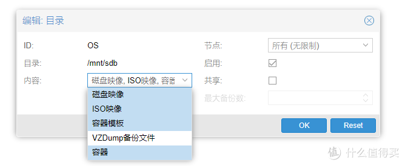

## ProXmoX VE 介绍

Proxmox VE是一款套开源的虚拟化管理软件，用户可通过网页的方式来管理服务器上使用 kvm 以及 lxc 技术运行的虚拟机。同时提供了一些先进功能的支持，如集群、HA等。
PVE虽然是开源，却是由一个商业公司在运营、更新以及维护。


 
## ProXmoX VE 安装
### 基础准备
1. 16G以上U盘一个(非必须，这个U盘是用来安装PROXMOX的，也可以直接装硬盘上，GEN8比较特殊，使用U盘引导比较方便，所以我安装在U盘上)；4G以上U盘一个；
2. 支持虚拟化技术的CPU；
3. 如果要虚拟软路由，需要有2个网口以上，最好千兆。
 
### 安装过程
首先去proxmox下载安装包，目前最新版本是5.2-1，推荐使用种子下载，速度会比较快，下载完成后务必使用使用工具进行SHA256校验，防止下载错误
然后使用软碟通或者rufus之类的工具把下载的ISO文件刻录进4G的U盘（本人使用GEN8的ILO4远程安装，有GEN8的朋友应该知道咋弄）。
接着把4GU盘和16GU盘插入电脑，BIOS中开启虚拟化支持（具体方法百度，BIOS太多，我就不放图了），一个网口接入路由，使用4GU盘引导启动很快就会进入安装界面。


此处选择第一项回车，稍微等待一会，进入下图界面


选择 I agree


这里选择你要安装的的硬盘或者U盘，选定后点击Next


这里一般会默认china，如果没有那就输入china，其他默认，点击Next


输入两遍管理密码并输入邮箱，点击Next


这里注意，查看一下是不是你局域网的网段，如果不是，很可能和路由之间网络不通，另外，Hostname这项的格式需为*.*，默认的是无法下一步的，我这里使用PVE.LEN，点击next，等待安装完成


出现如上界面时，说明安装已经完成，点击reboot，重启过程中拔掉U盘，然后设置为你安装的U盘或者硬盘启动，等待重启完成。


出现如上界面时说明安装完成了,用另外一台电脑在浏览器中输入上面的地址进行访问


language选择chinese就可以中文访问啦，用户名输入root，密码为刚才安装时候输的两遍管理密码

## ProXmoX VE 初始配置


由于proxmox一些功能是需要付费订阅的，虽然可以免费使用，但是每次登陆时候都会弹出如上让你订阅的通知，比较烦，我们这里通过技术手段把它屏蔽掉。
首先点击确定把它关掉，然后通过winscp打开以下文件 

```
/usr/share/javascript/proxmox-widget-toolkit/proxmoxlib.js 
```


或者直接在web界面的shell中使用vi、nano等工具编辑找到

``` 
if (data.status!=='Active')  
```

替换为

```
if (false) 
```

这条位置比较靠后，大约在800行，替换完成后保存文件，注销登陆，清理浏览器缓存，再次登陆，发现已经不再弹窗让你订阅啦。
接下来下来我们更新一下proxomx的软件，proxmox的底层毕竟是个debian系统，刚安装还是要更新一下的，在shell中输入```aptupdate && apt dist-upgrade```，回车，发现报错无法更新，查看官方文档发现需要更改一些设置，在shell输入

```sh
rm -f /etc/apt/sources.list.d/pve-enterprise.list #移除原更新原地址
```

添加新的原地址

```sh
echo "deb http://download.proxmox.com/debian/pve stretch pve-no-subscription" > /etc/apt/sources.list.d/pve-install-repo.list
```

下载秘钥

```sh
wget http://download.proxmox.com/debian/proxmox-ve-release-5.x.gpg -O /etc/apt/trusted.gpg.d/proxmox-ve-release-5.x.gpg
```

更新

```sh
apt update && apt dist-upgrade
```

等待更新完成，输入 

```sh
reboot
```

重启服务器

## ProXmoX VE 磁盘映射

如果你的proxmox是直接安装在硬盘上的，那已经可以正常使用了，如果你和我一样是安装在U盘的，因为U盘空间比较小，需要弄个硬盘用来安装虚拟机


在磁盘中看下哪个是你要挂载的硬盘，，我这里需要挂载的设备目录为```/dev/sdb```
在shell中输入

```sh
mkdir /mnt/sdb
```

创建sdb文件夹用来给磁盘挂载
输入```fdisk /dev/sdb```管理这个硬盘，给它分区
输入n新建分区


输入p建立主分区


输入1创建一个分区


这里是让输入这个分区的扇区起始位置，我们选择默认，直接回车


分区的扇区结束位置，默认，直接回车，到此就分区完成了，我们输入p查看一下


分区已经完成，目录为```/dev/sdb1```
输入w，保存并退出fdisk工具
输入

```sh 
mkfs -t ext4 /dev/sdb1
```

格式化一下
输入

```sh
mount /dev/sdb1 /mnt/sdb
```

进行挂载
为了使proxmox可以开机自动挂载
我们输入

```sh
nano /etc/fstab
``` 

编辑一下这个文件，在最后追加

```sh
/dev/sdb1 /mnt/sdb ext4 defaults 0 0
```

保存退出
这样就不用每次开机mount了
然后依次点击数据中心-存储-添加-目录




ID随意，目录输入刚才挂载的目录，内容都选上，点添加，

最后点OS查看一下是否正常识别


基础安装完工